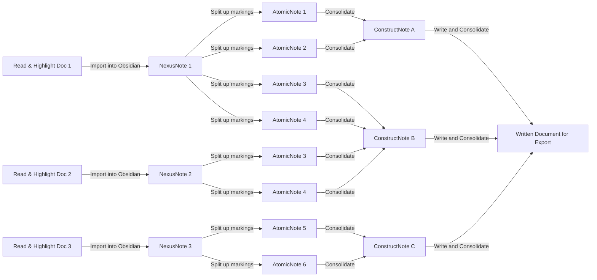

# What _is_ this?

Work in progress! Tested on Linux Ubuntu and Windows 11. Color scheme configured for dark themes.

This repository contains an [Obsidian](https://obsidian.md/) Vault Template—an empty vault preconfigured with (almost) all relevant settings, templates, and scripts. It can be easily copied and used as a starting point for streamlined note-taking. It contains several functionalities which support a specific reading-writing workflow for automatically import and manage document highlights, converting them into atomic notes and re-combine them in construct notes, where new concepts, ideas, documents sections or other content are created. All of that without ever copy-pasting. **That** is what I call [percolating](https://en.wikipedia.org/wiki/Percolation_theory) [smoothly](https://media.makeameme.org/created/smooth-5cb761.jpg).

# Yes, but *why*?

When reading (technical) literature, I underline passages and add comments, but these annotations often end up unused or require tedious copy-pasting to another tool. Keeping track of sources for proper citation management is another hassle.

Typically, my notes end up scattered across Google Docs or `.tex` files, where I later refine and integrate my own ideas. While LaTeX helps with structured writing, it still demands careful handling. Collaboration outside academia/tech introduces another challenge—mentioning "LaTeX" usually elicits the wrong imagery, so Google Docs often becomes the default. Unfortunately, these tool limitations disrupt my/the/yours?/any writing process.

Obsidian covers already much of what I want in a modern writing tool, but not everything. I built upon an already excellent Obsidian setup, adding my own scripts and enhancements to create a workflow that offers:

- **No more copy-pasting or drag-and-dropping** – Completely eliminates the need for copy-pasting and thus, human error. Automate content extraction, management and note creation with correct metadata using custom JavaScript extensions, [Templater Plugin](https://github.com/SilentVoid13/Templater), and [Dataview Plugin](https://blacksmithgu.github.io/obsidian-dataview/). 
- **Consistent metadata handling** – New notes are automatically linked, even on the Canvas, and inherit relevant metadata via [Templater](https://github.com/SilentVoid13/Templater) and [Metadata Menu Plugin](https://mdelobelle.github.io/metadatamenu/).
- **No manual citation management** – Track and display sources effortlessly using citekeys via [Obsidian-Zotero integration](https://github.com/mgmeyers/obsidian-zotero-integration) and [Pandoc Reference List](https://github.com/mgmeyers/obsidian-zotero-integration).
- **Cross-platform flexibility** – Export seamlessly to LaTeX, MS Word, Google Docs, and more with [Pandoc integration](https://github.com/OliverBalfour/obsidian-pandoc).
- **Beautiful math rendering** – Supports LaTeX-style equations natively in Obsidian Markdown.
- **Code syntax highlighting** – Works out of the box with Obsidian Markdown.
- **Text and code integration** – Run code snippets in multiple languages via the [Execute Code Plugin](https://github.com/twibiral/obsidian-execute-code) (though it's not as robust as Quarto MD, Jupyter, or Pluto Notebooks).
- **Rich media support** – Natively reference websites, PDFs, audio, video, images, diagrams, and more.
- **Local AI integration** – Use LLMs, audio/video transcription, and other AI tools while keeping everything offline when needed (custom extensions via JavaScript and [Templater Plugin](https://github.com/SilentVoid13/Templater)).
- **Seamless collaboration & reusability** – Notes remain in plain text, and even diagrams can be drawn using [Mermaid](https://mermaid.js.org/), ensuring accessibility for both human and machine systems.

# Workflow Description

The **Smooth Percolation Workflow** is all about **breaking down** imported documents (**NexusNotes**) into bite-sized, useful nuggets (**AtomicNotes**) and **remixing them** into something new (**ConstructNotes**). It is inspired by the [Zettelkasten](https://de.wikipedia.org/wiki/Zettelkasten) method, but just loosely. Think of it as intellectual composting—turning raw highlights into fertile ground for ideas.

Linking AtomicNotes to ConstructNotes? Just drag a connection on the **SynthesisCanvas**, and Obsidian does the rest. No tedious manual linking—automation takes care of the boring stuff.

And yes, **every dull, repetitive step is automated**. But the thinking is **on you.** Some things just shouldn't be left to machine minds… yet. 

Below a illustration of the workflow and below below a detailed description:

### **Reading and Documentation Phase**

1. **Import the document into Zotero** and curate its metadata. A reference manager like Zotero is the best tool for this task.
2. **Read and annotate the document** using Zotero’s built-in PDF reader (which now includes a dark mode). Highlight important text, add comments, and mark figures.  
    **Note:** Steps 1 and 2 can be done in reverse. You can read and annotate the document in any PDF reader before importing it into Zotero.
3. **Import the document into Obsidian** (details below). This creates a new note named after the Zotero _citekey_, which serves as the document’s representation inside your vault. I call these notes **NexusNotes**. The import includes:
    - All relevant metadata
    - All highlighted text
    - All comments
    - All marked figures (imported as images)
    - Direct links to the original PDF pages, allowing quick navigation back to the source
4. **Extract and refine ideas into AtomicNotes.** Go through the extracted content and break it down into **AtomicNotes**—self-contained, irreducible ideas that can stand alone without context. These can be equations, code snippets, concepts, or key ideas. Extracting knowledge in atomic form is challenging but helps in deeper comprehension.
    - AtomicNotes are automatically linked to their corresponding NexusNotes.
    - Tags must be assigned to categorize them by topic.
    - The process is **semi-automated** (details below), ensuring that all metadata from the NexusNote carries over.
5. **Repeat step 4** until the NexusNote contains only links to its AtomicNotes, with no standalone text remaining.
6. **Repeat steps 1–5** for any additional documents of interest.

### **Writing Phase**

7. **Create one or more ConstructNotes.** These serve as containers for organizing and synthesizing AtomicNotes into structured content. A ConstructNote can represent:
    - A document section (e.g., Introduction, Methodology)
    - An abstract concept, definition, or equation
    - A paragraph or smaller unit of thought
    - Any other structured form of writing
8. **Organize ConstructNotes in the SynthesisCanvas.**
    - Drag ConstructNotes onto the SynthesisCanvas (or set up a query for automatic addition, as described below).
    - Link relevant AtomicNotes to their respective ConstructNotes.
    - **NexusNotes are no longer relevant at this stage**—the goal is to synthesize ideas, not track their sources.
    - The linking process is **deliberately manual** to ensure conscious thought and structured reasoning. (Obsidian automatically maintains these links.)
9. **Merge AtomicNotes into ConstructNotes.** Once the structure is set, bundle the content from linked AtomicNotes into the corresponding ConstructNote using a **template-based automated process**.
10. **Write.** Shape your ideas, refine your arguments, and—if possible—solve the energy crisis and prevent the water wars.
11. **Export the final document** to your desired format using Pandoc. The bibliography can be exported as BibTeX or copied directly via the Pandoc Reference List plugin.

# Functionalities which enable/support the percolation workflow

All commands need to be run in editing view. The GPU reliant commands can technically also be run with a CPU, but is incredibly slow. You don´t require a GPU for the proposed workflow, it is just a convenience. The important part (Zotero import, atomization and note-integration) can all be run without GPU.

| Functionality                                                                             | Requires GPU | Vault State                                   | Command                                                           | Effect                                                                                                                                                                                                                                                                                                                                                                                                                                                                                                                                                                                                                                                                                             |
| ----------------------------------------------------------------------------------------- | ------------ | --------------------------------------------- | ----------------------------------------------------------------- | -------------------------------------------------------------------------------------------------------------------------------------------------------------------------------------------------------------------------------------------------------------------------------------------------------------------------------------------------------------------------------------------------------------------------------------------------------------------------------------------------------------------------------------------------------------------------------------------------------------------------------------------------------------------------------------------------- |
| Media to Vault: Creates NexusNote. Get all metadata and highlights of Zotero items        | No           | Any, Zotero must run                          | `Zotero integration: item_importer`                               | Opens a file selector for all documents stored in [Zotero](https://www.zotero.org/). Once selected, it imports **metadata, highlights, notes, and marked images**, creating a dedicated folder under **NexusNotes**. The import process follows the template in `Templates/zotero_item_importer_template.md` and is based on this excellent [Medium article](https://medium.com/@alexandraphelan/an-updated-academic-workflow-zotero-obsidian-cffef080addd) by Alexandra Phelan.                                                                                                                                                                                                                   |
| Media to Vault: Creates NexusNote. Get all Metadata from Google Books API. Books only     | No           | Any                                           | `Book Search: Create new Book note`                               | Designed for books only, this creates a NexusNote with **metadata but no highlights**, using fields available from the **Google Books API**. It relies on the [Obsidian Book Search Plugin](https://github.com/anpigon/obsidian-book-search-plugin) by [anpingon](https://github.com/anpingon). A custom template (`Templates/bookPlugin_item_importer_template.md`) ensures metadata consistency across NexusNotes.                                                                                                                                                                                                                                                                               |
| Media to Vault: Converts audio file into NexusNote                                        | Yes          | Active Audio file                             | `Templater: Create Templates/audio_to_note.md`                    | When an **audio file (MP3, WAV, M4A, OGG, FLAC)** is open in Obsidian, this tool uses [VoxBox](https://github.com/gpustack/vox-box) to generate a **transcription** via OpenAI Whisper, FunASR, Bark, or CosyVoice. The result is then sent to [Ollama](https://ollama.com/) for **note title, tags, and explanation generation**.                                                                                                                                                                                                                                                                                                                                                                 |
| Media to Vault: Inserts audio file transcription at cursor position                       | Yes          | Cursor position in active editor              | `Templater: Insert Templates/insert_audio_transcription.md`       | Select an audio file from `RawArtifacts/Audios`. Once chosen, the file is transcribed using VoxBox and the transcript is inserted at the **cursor’s position**. *Note: May fail on the first attempt if the server isn’t running yet—just try again. Low-quality audio may also cause transcription errors.*                                                                                                                                                                                                                                                                                                                                                                                       |
| Media to Vault: Inserts image file description at cursor position                         | Yes          | Cursor position in active editor              | `Templater: Insert Templates/insert_image_interpretation.md`      | Select an image file (PNG, JPG, JPEG, WEBP, GIF) from `RawArtifacts/Images` (excluding the `Banners` folder). The image is analyzed using [LLaVA](https://ollama.com/library/llava) via the **Ollama backend**. A prompt popup allows specifying tasks like `"focus on OCR"` or `"extract table"`. The generated description is inserted at the **cursor’s position**.                                                                                                                                                                                                                                                                                                                             |
| Content Splitting. Creates AtomicNotes from NexusNote Content                             | Yes          | Selected text                                 | `Templater: Insert Templates/atomize_note_extract_text_llm.md`    | Extracts the selected text into a **new note**. A popup prompts for a "note type," allowing categorization. The selected text is replaced with a **link to the new note**, which also includes a **backlink to the source note**. Relevant metadata is inherited, and **LLM-generated** title/tag suggestions and an explanation of the extracted text are appended (purely for inspiration).                                                                                                                                                                                                                                                                                                      |
| Content Splitting. Creates AtomicNotes from NexusNote Content                             | No           | Selected text                                 | `Templater: Insert Templates/atomize_note_extract_text_no_llm.md` | Same as the previous feature, but **titles and tags must be specified manually** via a popup instead of using AI-generated suggestions.                                                                                                                                                                                                                                                                                                                                                                                                                                                                                                                                                            |
| Content Creation: Spawn a ConstructNote and fill metadata                                 | No           | Any                                           | `Templater: Create Templates/spawn_construct_note.md`             | Creates a **ConstructNote** in the correct directory. Popups prompt for defining metadata properties such as `type of construct` (e.g., document section, definition, abstraction) and `project` (for grouping related ConstructNotes). This tool **mitigates manual copy-pasting** but can also be done manually if needed.                                                                                                                                                                                                                                                                                                                                                                       |
| Content Creation: Gathers all text from linked Notes on the Canvas under a certain header | No           | Cursor position in active editor              | `Templater: Insert Templates/integrate_notes_into_target.md`      | When **drawing links on the SynthesisCanvas** between **AtomicNotes and ConstructNotes**, the `links_to_constructs` metadata property is **automatically updated** with the correct links (enabled via the [Metadata Menu](https://mdelobelle.github.io/metadatamenu/) plugin). Activating the template **pulls text from all linked notes** into the active ConstructNote, but only from the `"Original Text"` section. This also works for links between ConstructNotes or even NexusNotes (*though linking NexusNotes isn’t recommended*). Only **links from the SynthesisCanvas** are considered, but they can be manually edited if needed. Another **automation to eliminate copy-pasting**. |
| Content Creation: Make a DataView query and move resulting files to the chosen canvas     | No           |                                               | See `example_query.md` in **Queries** folder.                     | This template was generously contributed by [Claudio Lassala](https://github.com/claudiolassala). Modify the sample query in the `Queries` folder to filter by **tags, folders, or other criteria**. The resulting list can then be **exported to a chosen canvas** (*note: the full path to the canvas must be specified, e.g., `ContentSynthesis/SynthesisCanvas`*). This template **removes the need for manual drag-and-drop**.                                                                                                                                                                                                                                                                |
| Content Creation: Make a JavaScript query and move resulting files to the chosen canvas   | No           |                                               | See `example_query.md` in **Queries** folder.                     | The same as the **Query-Based Canvas Export**, but uses **JavaScript queries** instead of **DataView queries**.                                                                                                                                                                                                                                                                                                                                                                                                                                                                                                                                                                                    |
| Content Management                                                                        | No           | Click on icon on classes in Templates/Classes | -                                                                 | Generates a **comprehensive overview table** of all members within a class.                                                                                                                                                                                                                                                                                                                                                                                                                                                                                                                                                                                                                        |

# Installation and Dependencies

- Modify the path to your pandoc installation in the Pandoc Reference List plugin settings

Rest is Coming Soon

# Plugins, their usage and further suggestions

Coming Soon

# Folder Structure Guide

Coming Soon

# Demonstration and Screenshots

Coming Soon

# Attribution

Coming Soon
